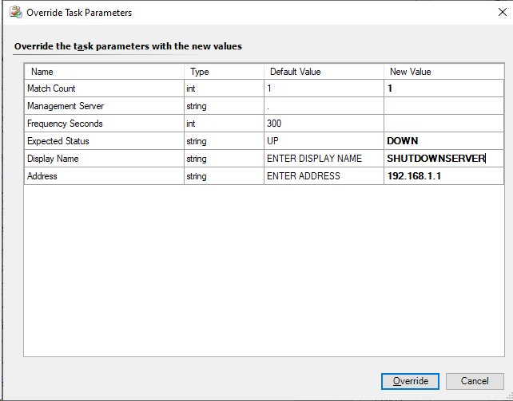

# Simple Ping SCOM Management Pack

* [MP](MPS/Simple.Ping.mp)
* [Visual Studio Solution](<Simple Ping>)

Monitoring is performed by the "Simple Ping Monitoring Resource Pool" which by default contains all management servers. Monitors the ping status matches the expected value either up or down.

Configuration is performed using two agent tasks. 

* Add Simple Ping
* Remove Simple Ping

# Adding Monitoring 

>Navigate to Simple Ping > Resource Pool.

>Use the Add Simple Ping task overriding the task properties to configuring monitoring.

# Removing Monitoring

>Navigate to Simple Ping > Targets. Select the target to remove and use the Remove Simple Ping task.
